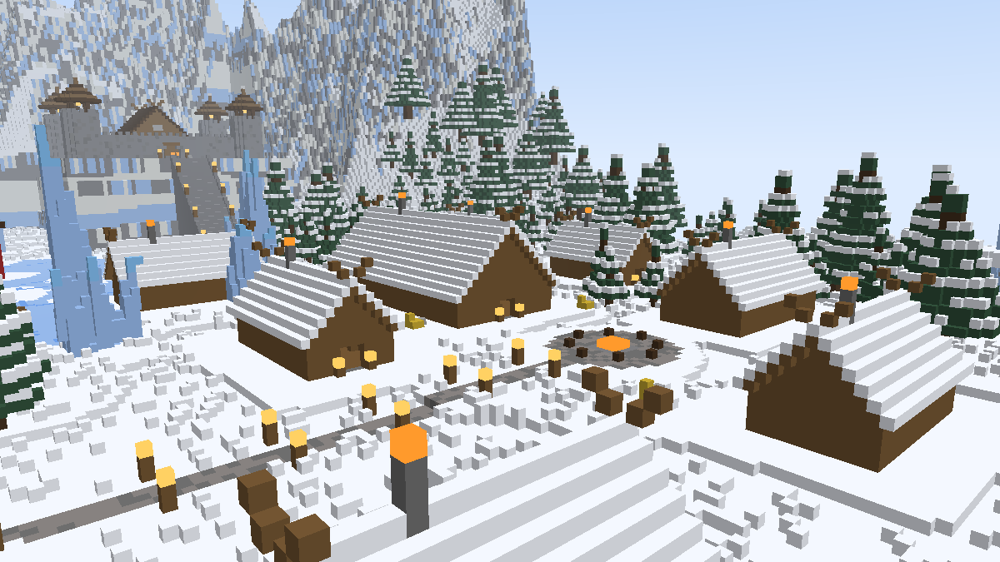
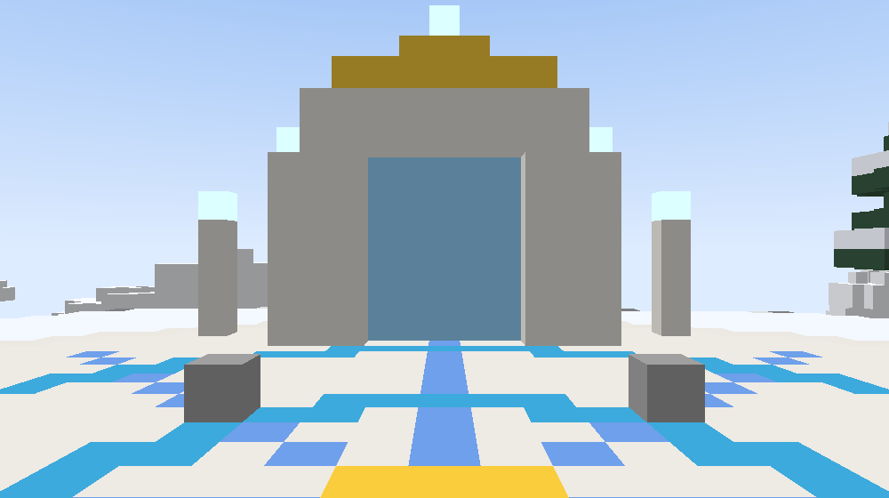

# Agartha — the Frozen Heaven (Minecraft Bedrock add-on)

Agartha is the heaven of your world: a vast floating Viking realm of snow, ice and quartz above a sea of clouds. There is exactly **one way in: the Gate of Agartha**, a portal you build in your world.

## What's in Agartha
A floating continent about **420 blocks across** at **X 200,000 / Z 200,000**, from the clouds (Y ~110) to the build limit (Y 318).

| Landmark | |
|---|---|
| **Heaven's Gate** | Where travellers arrive: a snowflake-inlaid plaza and two 45-block quartz-and-ice pillars crowned with beacon beams, under a golden sun. The **return portal** stands right behind the arrival point. |
| **The Processional Avenue** | A lamp-lit quartz road guarded by two **All-Father statues** (~55 blocks tall), crowned, horned and holding glowing staffs. |
| **The Great Bridge** | A 130-block arched bridge over the **frozen lake**, where three **Viking longships** with striped sails and shields lie locked in the ice. |
| **The Temple of Agartha** | A three-tier quartz terrace, a colonnaded ice-glass hall with the All-Father's throne, a sacred beacon, and a skyline of **ice spires** up to 70 blocks tall. |
| **The Colossus** | An ~85-block All-Father carved into the mountainside above the temple. |
| **The Jarl's Citadel** | A walled Viking stronghold on a cliff terrace, reached by a grand stair. Its great hall leads into a mountain tunnel and the **treasure vault**. |
| **The Village** | Eight snow-roofed longhouses with smoking chimneys around a bonfire square, including a 39-block **mead hall**, linked to the avenue by a lantern road. |
| **Ice Pyramids** | Three stepped pyramids of calcite, quartz and ice, each with a beacon. The largest hides a jarl's **burial chamber**. |
| **Nature** | A ring of mountains with snow, ice and white-stone cliffs; snowy spruce forests; giant ice crystals; floating islets; goats, polar bears, wolves and foxes. |
| **Atmosphere** | Soft heavenly haze, falling snow, drifting golden motes, aurora curtains glowing overhead at night, and permanent night vision. No hostile mobs spawn. |

| | |
|---|---|
|  |  |
|  |  |
|  | |

*(Previews come from `tools/preview.mjs`, a simple voxel renderer of the exact blueprint, not in-game screenshots.)*

## The Gate of Agartha (the one portal)
1. In creative, get the portal block from the creative inventory (*Gate of Agartha*) or with `/give @s agartha:portal`.
2. Build any frame you like and fill the opening with portal blocks (e.g. 3 wide × 4 tall). The first portal block placed **founds the Gate**. Blocks within 12 of it are part of the same Gate.
3. **Only one Gate can exist.** Portal blocks placed anywhere else are removed, with a message saying where the Gate stands. To move it, break the old one and run `/scriptevent agartha:portal_reset`.
4. **Walk into the Gate**: you arrive at Heaven's Gate in Agartha.
5. **Walk into the return portal** behind the arrival point, or tap any **Runestone**: you're returned to the exact spot you stepped in from, facing away from the Gate.

Portal blocks glow, can't be broken in survival or by explosions, and have no collision.

## Other rules
- **Falling off Agartha** below the clouds: instant death, then a normal respawn in the mortal world. Creative and spectator players are put back at the arrival point instead.
- **Dying** anywhere else works normally; nobody is sent to Agartha without walking through the Gate.
- **Loot:** the vault, the temple and the pyramid chamber hold *Viking hoards* (gold, diamonds, enchanted books, and the rare **Jarl's Frostbite Axe**). Longhouses hold food and **Horns of Honey Mead**.

## Operator commands
| Command | Effect |
|---|---|
| `/scriptevent agartha:forge` | Build Agartha now. |
| `/scriptevent agartha:rebuild` | Rebuild it from scratch (everyone must leave first). |
| `/scriptevent agartha:visit` | Go there yourself, without the Gate. |
| `/scriptevent agartha:portal_reset` | Forget the Gate's location so a new one can be built. |

## Building ("forging") and safety
- Agartha is **built automatically** about 15 seconds after the world loads, once. It runs in the background with progress messages in chat and takes a few minutes, depending on the device. If someone walks through the Gate before it's done, they're told to try again shortly.
- Bedrock add-ons **can't create real dimensions**, so Agartha lives in a reserved pocket of the Overworld sky. **Every block write is bounds-checked** against one box (X/Z 199,680 → 200,319, Y 96 → 319). Nothing outside it is ever changed, and world generation is untouched. `tools/test_blueprint.mjs` verifies all ~800,000 build operations stay inside.
- The build uses one temporary ticking area at a time (the world limit is 10).
- Requires Bedrock **1.21.90+**. Works on new and existing worlds; no experimental toggles are needed.

## Install
Run `./tools/package.sh` and open `dist/Agartha.mcaddon`, then activate **both** packs on your world.

## Development
| Command | Purpose |
|---|---|
| `node tools/test_blueprint.mjs` | Bounds, tile, and terrain checks for the whole build. |
| `node tools/smoke_test.mjs` | Runs the scripts against a mock Minecraft API: forging, founding the one Gate, refusing a second one, travelling both ways, runestones, falling. |
| `node --max-old-space-size=4096 tools/preview.mjs && python3 tools/ppm2png.py` | Renders preview images into `dist/preview/`. |
| `python3 tools/gen_textures.py` | Regenerates textures. |

The layout lives in `behavior_pack/scripts/terrain.js` (`LAYOUT`), the landmarks in `structures.js` and `citadel.js`, and location and heights in `config.js`. Bump `buildVersion` to rebuild existing worlds after changes.
