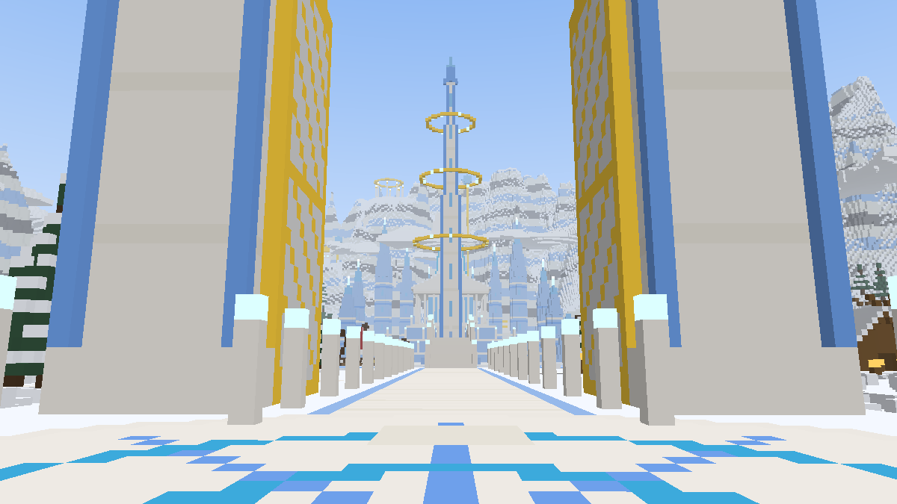
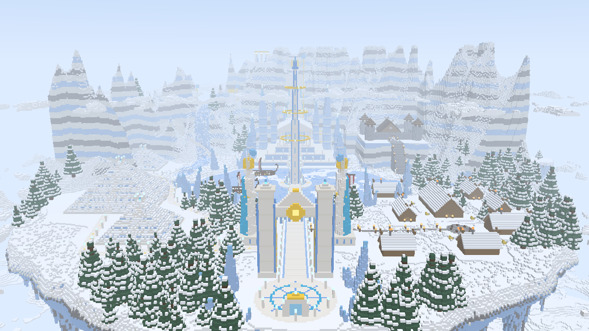
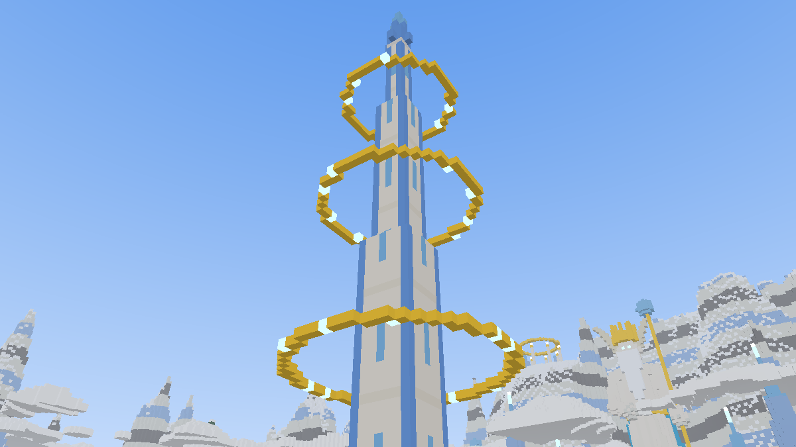
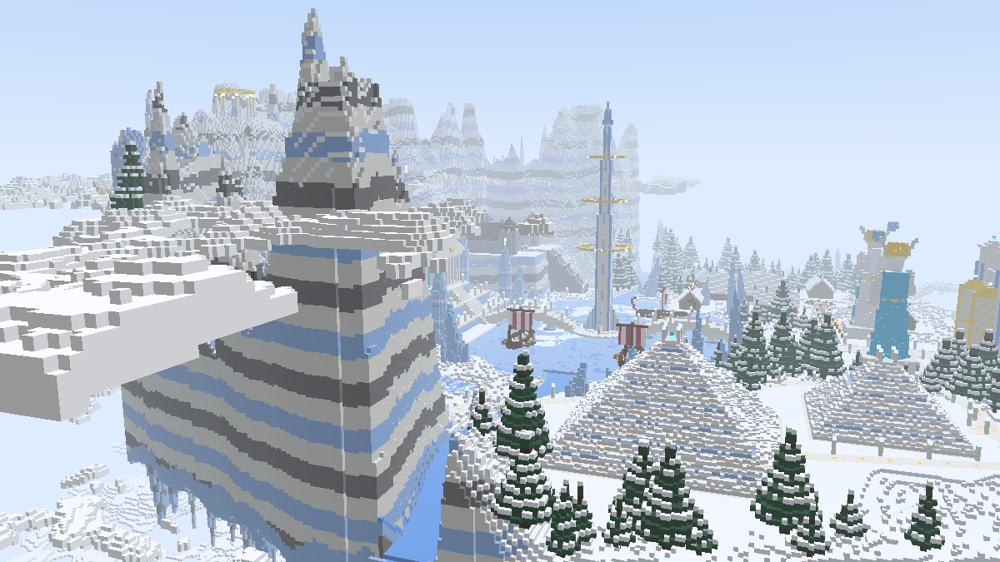
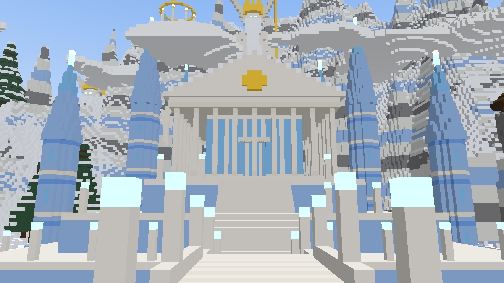
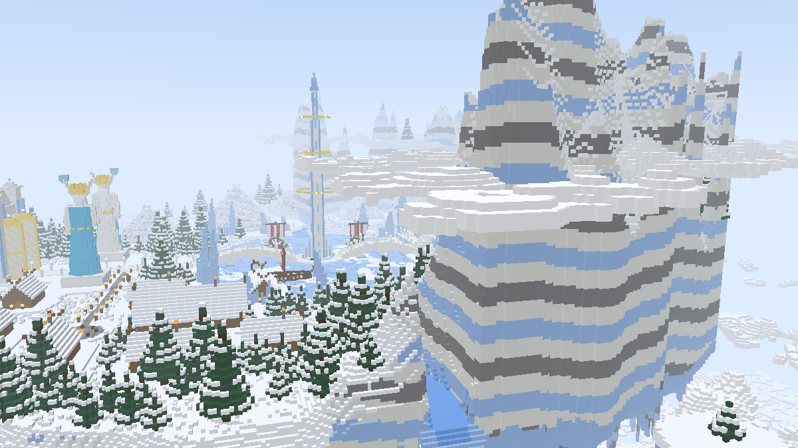
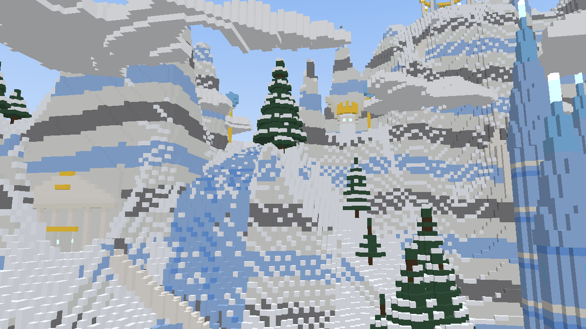

# Agartha: the Frozen Heaven (Minecraft Bedrock add-on)

Agartha is the heaven of your world: a vast floating Hyperborean realm of snow, ice, quartz and gold above a sea of clouds. It's laid out after Mercator's map of the far north. A frozen lake at the centre holds **the Pole**, and four ways lead out from it. There is exactly **one way in, the Heavenly Gate, and one way out**.

## 1. Forging Agartha (do this first, in person)
1. As an operator, run **`/scriptevent agartha:forge`**.
2. You're switched to spectator mode and **carried over the build site** while Agartha is built. Your presence is what loads the far-away chunks, and it's why forging is reliable now. Stay in the game; progress shows in the action bar and chat.
3. When it's done, you're returned to where you started, in your original game mode, and you receive the **Keystone of the Heavenly Gate**.

Progress is saved. If forging is interrupted (you log off, the game closes) or some sections can't load, run `/scriptevent agartha:forge` again and it continues where it stopped.

## 2. Raising the Heavenly Gate (the one entrance)
Use the **Keystone** on the ground where the entrance should stand. A quartz-and-ice archway with open golden gates rises there, facing you, with a glowing portal inside. Walk through it to arrive at the Gates of Agartha.

- There is **only one Gate**. Portal blocks can't be placed anywhere else, and there's only one Keystone.
- If the Gate is torn down completely, its **Keystone returns** to whoever broke the last of it, so the Gate can be raised again somewhere else.

## 3. Leaving (the one exit)
The **return portal** stands right behind the arrival point. Walk through it and you're returned to the exact spot you entered the Gate from, facing away from it. The exit can be broken like any block, but it **mends itself** within seconds, so nobody is ever trapped.

Falling off Agartha through the clouds is instant death, followed by a normal respawn in the mortal world.

## The All-Father
The All-Father stands before the Gates of Agartha. As each traveller arrives he turns to them, opens his arms, and welcomes them home ("Welcome home, my child. You did well."). He can't be harmed or pushed and has no name tag.

**Changing his skin:** replace `resource_pack/textures/entity/allfather.png` with any **64×64 Minecraft skin** (classic, 4-pixel arms). Any skin editor works. Rebuild the `.mcaddon` (or edit the installed resource pack) and he'll wear it.

## What's in Agartha
A floating continent about **420 blocks across** at **X 200,000 / Z 200,000**, from the clouds (Y ~110) to the build limit (Y 318).

| Landmark | |
|---|---|
| **The Heavenly Gates** | Where travellers arrive: a snowflake plaza, two 45-block quartz pillars crowned with beacon beams, golden gates thrown open, a golden sun, and the All-Father waiting. |
| **The Processional Avenue** | A lamp-lit quartz road (the southern way) guarded by two crowned All-Father statues. |
| **The Pole** | A quartz-and-ice tower rising from an island in the frozen lake almost to the sky, circled by three floating golden halos and crowned with a beacon. |
| **The Great Bridge** | Two arched spans over the frozen lake, from the avenue to the Pole and on to the temple. Three **Viking longships** lie locked in the ice. |
| **The Four Ways** | Besides the avenue: a **glacier** flowing down from the northern mountains, and **frozen rivers** east and west. Each spills over the edge of the world as a huge **icefall** into the clouds. |
| **The Temple of Agartha** | A three-tier quartz terrace, a colonnaded ice-glass hall with the All-Father's throne and a sacred beacon, and a skyline of **ice spires**. |
| **The Colossus** | An ~85-block All-Father carved into the mountainside above the temple. |
| **Carved into the mountains** | Two **rock-cut halls** with columned facades and treasure altars inside; two **glacier guardians** standing in the cliffs either side of the glacier; the **Pilgrim's Stair**, cut into the rock and tunnelling through the mountain from the colossus to the **Shrine of the Pole Star** on the high summit. |
| **The Jarl's Citadel** | A walled Viking stronghold on a cliff terrace, reached by a grand stair, with a tunnel into the mountain and a **treasure vault**. |
| **The Village** | Eight snow-roofed longhouses with smoking chimneys, a 39-block **mead hall** and a bonfire square. |
| **Ice Pyramids** | Three stepped pyramids with beacons; the largest hides a **burial chamber**. |
| **Pathways** | Quartz paths with gold inlay and lamps link the avenue, pyramids, temple, glacier, halls and citadel. Where the land is steep they cut stairs into the rock; over rivers they become bridges. |
| **Mountains & sky** | A crown of needle-peaked mountains with white, ice-blue and stone strata and snow-dusted ledges. Cloud belts drift between the peaks, cloud banks float around the edges, and a sea of clouds lies below. |
| **Atmosphere** | **Aurora curtains** (green, teal and violet) ripple over the mountains day and night, along with drifting mist, falling snow, golden light motes and a soft heavenly haze. No hostile mobs spawn. |

| | |
|---|---|
|  |  |
|  |  |
|  |  |

*(Previews come from `tools/preview.mjs`, a simple voxel renderer of the exact blueprint, not in-game screenshots. Particles such as the aurora aren't shown.)*

**Everything in Agartha can be broken**, including the clouds and the portal blocks (the exit mends itself). Loot: hoards in the vault, temple, rock-cut halls and pyramid chamber (gold, diamonds, enchanted books, the rare **Jarl's Frostbite Axe**). Longhouses hold food and **Horns of Honey Mead**.

## Operator commands
| Command | Effect |
|---|---|
| `/scriptevent agartha:forge` | Forge Agartha in person (or finish an interrupted forge). |
| `/scriptevent agartha:rebuild` | Rebuild from scratch (everyone must leave Agartha first). |
| `/scriptevent agartha:keystone` | Get the Keystone again (only when no Gate stands). |
| `/scriptevent agartha:gate_reset` | Forget the Gate's location, e.g. if it was destroyed by other means. |

## Safety
Bedrock add-ons **can't create real dimensions**, so Agartha is a sealed pocket of the Overworld sky, 200,000 blocks out. **Every block the forge writes is bounds-checked** against one reserved box (X/Z 199,648 → 200,351, Y 96 → 319), and world generation is never changed. `tools/test_blueprint.mjs` verifies all ~820,000 build operations stay inside. The only thing built outside that box is the Heavenly Gate, where *you* choose to raise it.

Requires Bedrock **1.21.90+**. No experimental toggles are needed.

## Install
Run `./tools/package.sh` and open `dist/Agartha.mcaddon`, then activate **both** packs on your world.

## Development
| Command | Purpose |
|---|---|
| `node tools/test_blueprint.mjs` | Bounds, tile and terrain checks for the whole build. |
| `node tools/smoke_test.mjs` | Runs the scripts against a mock Minecraft API: forging in person, the Keystone, the Gate, both portals, the All-Father, exit mending, falling, the Keystone returning. |
| `node --max-old-space-size=6000 tools/preview.mjs && python3 tools/ppm2png.py` | Renders preview images into `dist/preview/`. |
| `python3 tools/gen_textures.py` | Regenerates textures, including the default All-Father skin. |

The layout lives in `behavior_pack/scripts/terrain.js` (`LAYOUT`), the landmarks in `structures.js` and `citadel.js`, and location and heights in `config.js`. Bump `buildVersion` to rebuild existing worlds after changes.
